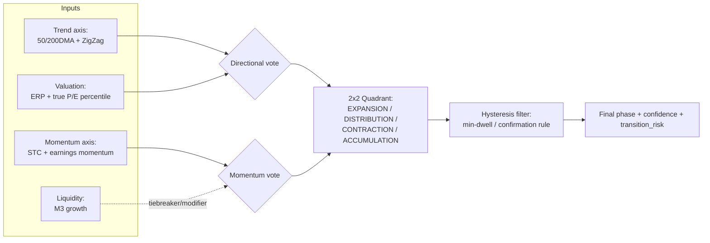

# Market Cycle Agent — Accuracy Improvement & Indicator Expansion Roadmap

**Scope of this document:** the **Market Cycle Specialist Agent** only
(`src/shankh/agents/market/cycle_signals.py`, `cycle_tools.py`, `cycle_agent.py`,
`config/prompts/market_cycle.md`) and its NIFTY 50 validation universe.

**Explicitly out of scope:** the Gaussian HMM regime model
(`src/shankh/agents/market/ml/regime_*.py`, exposed via `mcp/tools/market.py`, port 8002).
It is a separate, parallel system (3-state risk-on/range-bound/risk-off, running on a
hardcoded 10-ticker proxy list) that nothing in the Cycle Agent calls. It is not touched,
not refactored, and not merged as part of this roadmap. If it should eventually be
retired or merged, that is a separate decision to make later.

The Market **Breadth** Agent (`breadth_agent.py` / `breadth_tools.py`) is also out of
scope for *changes* in this phase, but its 150-ticker `data/universe/` dataset is
referenced below because it is the most natural existing source for a real NIFTY 50
universe once Phase 6 (universe expansion) begins.

---

## 1. Executive Summary

**Current architecture.** The Cycle Agent is a LangGraph tool-calling agent
(`build_cycle_agent`) bound to five deterministic Python tools in `cycle_tools.py`. The
tools fetch data (Nifty OHLCV via FMP/yfinance, valuation via FMP, liquidity via FRED,
earnings via a 15-stock yfinance basket), score each signal in `[-1, +1]`, and
`classify_cycle()` in `cycle_signals.py` turns the scores into a phase. The LLM's job is
narration only — it does not compute the classification, which is good practice and
should be preserved.

**Current problem, in one sentence.** The classifier is not actually a 4-pillar model —
`classify_cycle()` decides the phase using **only two signals** (`trend_context` and
`stc`), while valuation, liquidity, and earnings only adjust the composite score and
confidence *after* the phase is already chosen. Combined with the complete absence of any
persistence/hysteresis mechanism, the classifier flips phase on average every **~11
trading days** (167 transitions across 623 backtest points, 2019–2026) — far too fast for
a construct meant to represent multi-month cycle positioning — and its `transition_risk`
early-warning signal tests at **no better than random** (precision lift 0.96) against an
independently-labeled set of major turns.

**Desired end state.** A Cycle Agent whose phase output (1) is genuinely driven by all
four pillars it claims to use, (2) persists at a timescale consistent with what "market
cycle" means (weeks-to-months, not days), (3) has a documented, reproducible, walk-forward
accuracy number the team can cite with confidence, and (4) has all five reference
indicators (STC, ZigZag, Candlestick Recognition, Harmonic Patterns, Gann Time Cycles)
evaluated — not just implemented — with an explicit, visualized comparison of what each
one actually contributes.

**Recommended strategy, in order:**
1. Fix the phase-decision mechanism itself (all 4 pillars → phase, not just 2) and add
   state persistence/hysteresis. This is the single highest-leverage change, because it
   attacks the two failure modes the existing backtest already proves are real.
2. Harden the evaluation framework that already exists (`backtest_cycle_phase.py`,
   `validate_cycle_classifier.py`) rather than rebuilding it — it is already
   well-designed (independent turn-labeling to avoid circularity, walk-forward, honest
   about a negative finding). Extend it to score the *fixed* classifier the same way, so
   before/after is directly comparable.
3. Only then implement and evaluate the 3 missing indicators (Candlestick Recognition,
   Harmonic Patterns, Gann Time Cycles), each judged individually and in combination
   against the same backtest — with the required visual comparison — rather than
   assumed to help because they're in the reference list.
4. Only after 1–3 are validated: expand past the current single-index (Nifty 50 index
   OHLCV only) scope toward a genuine cross-sectional Nifty 50 universe, and unify it
   with the universe the Breadth Agent already uses.

---

## 2. Current Architecture

```mermaid
flowchart TD
    A[cycle_agent.py<br/>LangGraph tool-calling agent] -->|calls, in order| B[get_market_cycle_synthesis]
    B --> C[get_market_cycle_metrics<br/>ERP + valuation]
    B --> D[get_liquidity_and_credit_cycle<br/>M3 growth]
    B --> E[get_index_earnings_momentum<br/>15-stock basket]
    B --> F[compute_zigzag / compute_stc /<br/>compute_trend_context<br/>cycle_signals.py]
    F --> G[classify_cycle&#40;&#41;<br/>trend x momentum 2x2 matrix]
    C -.feeds composite score only, not phase.-> G
    D -.feeds composite score only, not phase.-> G
    E -.feeds composite score only, not phase.-> G
    G --> H[cycle_phase, cycle_confidence,<br/>transition_risk, composite_score]
    H --> I[config/prompts/market_cycle.md<br/>narrates into Executive Brief]

    J[data: FMP / yfinance<br/>Nifty 50 index OHLCV] --> F
    K[data: FMP<br/>P/E, P/B, div yield] --> C
    L[data: FRED<br/>India 10Y yield, M3] --> C
    L --> D
    M[data: yfinance<br/>15-stock earnings basket] --> E
```

**Components:**
- `cycle_signals.py` — pure functions, unit-tested (`tests/unit/test_cycle_signals.py`,
  12 tests), no I/O. This is the right place to make changes; it's already isolated from
  data-fetching and LLM concerns.
- `cycle_tools.py` — LangChain `@tool`-decorated data fetchers + the orchestration tool
  `get_market_cycle_synthesis` that assembles evidence and calls `classify_cycle()`.
- `cycle_agent.py` — thin LangGraph agent wiring, binds the 5 tools + the system prompt.
- `config/prompts/market_cycle.md` — the agent's "constitution": scope boundaries,
  mandatory tool-call order, phase definitions, output format. Already states the phase
  definitions correctly (`EXPANSION`/`DISTRIBUTION`/`CONTRACTION`/`ACCUMULATION`) and
  already documents `transition_risk` honestly as a modifier, not a 5th state.
- `scripts/backtest_cycle_phase.py`, `scripts/validate_cycle_classifier.py`,
  `scripts/cycle_dashboard.py` — existing evaluation + demo tooling. **Reuse these.**

**Data flow:** Data Source (FMP/yfinance/FRED) → Tool-level fetch + fallback handling →
Signal scoring (`[-1, +1]` per signal) → `classify_cycle()` weighted-evidence combination
→ Phase + confidence + transition risk → LLM narration → Executive Brief.

---

## 3. Current Market-Cycle Implementation — The Four Parameters, Precisely

Per `config/prompts/market_cycle.md` line 4, the four pillars this agent is scoped to are:

| # | Pillar | Signal(s) | File | Data Source | Tier weight |
|---|--------|-----------|------|--------------|-------------|
| 1 | **Momentum / price structure** | ZigZag swing structure, Schaff Trend Cycle (STC), 50/200DMA trend context | `cycle_signals.py` | Nifty 50 index OHLCV (FMP → yfinance fallback) | `core` (0.6) |
| 2 | **Valuation** | Equity Risk Premium (1/P/E − India 10Y yield), P/E 10Y percentile (see 3.1 below) | `cycle_tools.get_market_cycle_metrics` | FMP quote/ratios API, FRED India 10Y | `supporting` (0.3) |
| 3 | **Liquidity** | M3 money supply growth YoY vs 9% threshold | `cycle_tools.get_liquidity_and_credit_cycle` | FRED (`MYAGM3INM189N`) | `supporting` (0.3) |
| 4 | **Earnings momentum** | Mean YoY quarterly earnings growth, 15-stock large-cap basket | `cycle_tools.get_index_earnings_momentum` | yfinance per-ticker | `supporting` (0.3) |

### 3.1 How the phase is actually decided (the core weakness)

`classify_cycle()` reads exactly two named scores out of the evidence list —
`trend_context` and `stc` — and applies a fixed 2×2 matrix:

| Trend | Momentum (STC) | Phase |
|---|---|---|
| Up | Up | `EXPANSION` |
| Up | Down | `DISTRIBUTION` |
| Down | Down | `CONTRACTION` |
| Down | Up | `ACCUMULATION` |

Valuation, liquidity, and earnings are folded into `composite_score` via tier-weighted
averaging (`core=0.6, supporting=0.3, contextual=0.1`), and into `cycle_confidence` via
"fraction of evidence items whose sign agrees with the composite sign" — but **neither of
those outputs can change which phase is reported.** A market that is expensive,
liquidity-tightening, and earnings-decelerating will still be labeled `EXPANSION` if price
is above its 200DMA and STC is rising. This is the single most consequential finding of
this audit and is the primary target of Phase 2 below.

### 3.2 Other implementation weaknesses found

- **No hysteresis.** Each evaluation point is classified independently from the current
  bars only; there is no dependency on the previous phase. Nothing prevents daily/weekly
  whipsaw. Confirmed empirically (Section 6).
- **P/E percentile is not actually a percentile.** `get_market_cycle_metrics` computes
  `pe_percentile` from four hardcoded threshold buckets (`>23 → 82`, `>21 → 68`, `<18 →
  25`, else `50`), not a real rolling percentile against 10 years of history, despite the
  prompt and README both describing it as a "10-Year Historical Percentile." This is a
  spec/implementation mismatch, not just an accuracy issue — it should be fixed or the
  claim should be corrected.
- **Confidence tiers (0.6/0.3/0.1) are not empirically derived** — unlike the
  `transition_risk` magnitude thresholds (0.9/1.35), which the code comments confirm were
  calibrated against the backtest, the tier weights appear to be a reasonable-sounding a
  priori choice. They should get the same treatment.
- **Fallback data quietly degrades quality.** P/E, P/B, dividend yield, India 10Y yield,
  and RBI stance all have hardcoded `FALLBACK_BENCHMARK` values that are used silently
  when live APIs (FMP/FRED keys) are unavailable. The prompt does require reporting the
  data-source label, which is good, but a backtest run without both API keys set will
  silently score valuation on stale, static numbers for the *entire* historical window —
  worth an explicit check before trusting any historical accuracy number.
- **Earnings & liquidity tools can silently drop out of the evidence list.**
  `get_market_cycle_synthesis` only appends the earnings/liquidity evidence items if their
  data isn't `insufficient_data`. That's the right behavior for missing-data handling, but
  it means the *effective* weighting scheme changes silently between evaluation runs
  depending on data availability — this should be logged/flagged, not just handled.
- **No look-ahead bias detected** in `cycle_signals.py` itself — `compute_zigzag`,
  `compute_stc`, and `compute_trend_context` all use only trailing windows ending at the
  latest bar. This is good and should be preserved as a hard constraint on any new code.

---

## 4. PDF/Bible Findings vs. Repo Reality

There was no single formal "Bible" PDF found in the repo; the closest equivalent is a
combination of three documents, which mostly agree with each other:

| Document | What it specifies | Alignment with code |
|---|---|---|
| `BE1_Financial_Assistant_...Learning_Material.docx` (also duplicated as `doc.md`) | High-level: "Market cycle agent: classify where the market may be in the cycle using **valuation, momentum, liquidity and earnings indicators**." | ✅ Matches the 4 pillars exactly — this is the origin of "four parameters." |
| `config/prompts/market_cycle.md` | The operational spec: exact phase definitions, exact tool-call order, exact output format, explicit "four pillars this agent is scoped to." | ✅ Matches code's data sources, ❌ does not match code's actual phase-decision logic (Section 3.1) — the prompt implies all four pillars drive the classification; the code only uses two. |
| `docs/design.md` | An earlier, more generic agent-architecture sketch (Regime Analyst with generic labels like "Bull trend," "Risk-on," etc.) | Superseded by the more specific `market_cycle.md` spec and the actual 4-phase Wyckoff-style taxonomy (`ACCUMULATION`/`EXPANSION`/`DISTRIBUTION`/`CONTRACTION`) in code. Treat `design.md` as historical context, not current spec. |
| 5-indicator reference image (user-supplied) | STC, ZigZag, Candlestick Recognition, Harmonic Patterns, Gann Time Cycles | STC + ZigZag implemented in the **Core/momentum tier only**; the other three not implemented anywhere in the repo (confirmed via full-repo grep). |

**Conclusion:** the reference material is internally consistent about *what* the four
pillars and five indicators should be. The gap is entirely in the **implementation**: the
phase-decision mechanism doesn't honor its own stated 4-pillar design, and 3 of 5
indicators are simply not built yet.

---

## 5. Gap Analysis

| Area | Current State | Reference/Ideal State | Gap | Priority |
|---|---|---|---|---|
| Phase-decision inputs | Only `trend_context` + `stc` (2 signals) decide phase | All 4 pillars (valuation, momentum, liquidity, earnings) should influence phase | High — root cause of mislabeled phases | **P0** |
| State persistence | None — independent classification per call | Phase should persist unless evidence strongly flips (hysteresis) | Confirmed: avg phase length ~11 trading days | **P0** |
| Early-warning signal (`transition_risk`) | Precision lift 0.96 (≈random) vs. independent turn labels | Should meaningfully outperform base rate | Large | **P0** |
| P/E percentile | 4 hardcoded buckets | Real rolling 10Y percentile | Spec/code mismatch | **P1** |
| Confidence tier weights (0.6/0.3/0.1) | A priori, not backtested | Empirically calibrated like `transition_risk` thresholds already are | Medium | **P1** |
| 5-indicator coverage | 2/5 (STC, ZigZag) | 5/5, each with an evaluation verdict | 3 missing entirely | **P2** (after P0/P1) |
| Indicator comparison visualization | None | Side-by-side comparison (signal frequency, forward returns, regime association, ablation) | Missing entirely | **P2**, ships alongside indicator work |
| Universe scope | Nifty 50 **index** OHLCV only (cycle); 150-ticker local parquet, git-ignored (breadth); 10 hardcoded tickers (HMM, out of scope) | A single, consistent Nifty 50 constituent universe shared across cycle + breadth | Three different, inconsistent universes | **P3** |
| Evaluation framework | Already exists and is well-designed (independent labeling, walk-forward, honest negative finding) | Extend to score the fixed classifier the same way | Small — reuse, don't rebuild | **P0** (extend), ongoing |
| Data fallback transparency | Source labels reported per-field | Same, but backtests should assert live-key availability before claiming historical accuracy | Small | **P1** |

---

## 6. Accuracy Improvement Strategy

### 6.1 What "accuracy" means here

Given the existing tooling, the most defensible ground truth is the one
`validate_cycle_classifier.py` already uses: **independently-labeled major price turns**
(local-extrema + minimum-retracement algorithm, deliberately *not* the classifier's own
ZigZag, to avoid circular validation). Keep this. Do not switch to a different ground
truth proxy without a clear reason — consistency across "before" and "after" measurements
matters more than which proxy is chosen.

Add, alongside the existing recall/precision-vs-turns metrics:
- **Phase persistence** (mean/median run length in trading days) — directly measures the
  whipsaw problem found in Section 6.2.
- **Forward-return-by-phase** (5/10/20-day forward Nifty return, grouped by
  `cycle_phase`) — tests whether phases are actually behaviorally distinct, which
  recall/precision against turns does not directly test.
- **Confusion against a coarser 2-state proxy** (e.g., realized-forward-return sign) as a
  sanity check, not a primary metric — the 4-phase taxonomy is directional+momentum, not
  a pure return-sign predictor, so this should inform, not grade, the model.

### 6.2 Root cause, confirmed empirically (not assumed)

Analysis of the existing `scripts/output/cycle_backtest_history.csv` (623 evaluation
points, 2019-01-23 to 2026-08-19, `step=3` trading days):

- **167 phase transitions** → mean phase duration **≈ 11 trading days (≈3.7 evaluation
  points)**. A construct meant to represent multi-month cycle positioning flipping every
  two weeks is, by construction, mostly noise.
- **Phase distribution is skewed:** `DISTRIBUTION` 240, `EXPANSION` 230, `ACCUMULATION`
  84, `CONTRACTION` 69 — trend-up phases (`EXPANSION`+`DISTRIBUTION`) account for 75% of
  all readings over a period that was net bullish for Nifty, which is plausible but should
  be re-checked once hysteresis is added (a persistence fix could either sharpen or blur
  this split — check, don't assume).
- **`validate_cycle_classifier.py` output (already run):** Recall @ 15-day lead = 46.4%
  (13/28 major turns), precision-vs-base-rate lift = **0.96** (i.e., an elevated
  `transition_risk` reading is no more informative than the model's unconditional firing
  rate). This is the clearest, most defensible evidence that the current mechanism is not
  accurate enough — it is a directly quoted result already sitting in the repo.

This means: **before touching indicators, fix the mechanism** that produces whipsaw and
uninformative transition warnings. Adding more inputs to a classifier that already
whipsaws on its existing inputs will not by itself fix whipsaw.

### 6.3 Proposed fix (evaluate via A/B backtest, don't assume it works)

Two changes, tested independently and then combined, each scored with the *same*
existing validation script so results are directly comparable:

1. **Make all 4 pillars vote on the phase**, not just adjust its score after the fact.
   Simplest defensible version: convert the 2×2 trend×momentum matrix into a weighted
   vote across all 4 pillar scores (each already normalized to `[-1, +1]`), using two
   independent axes — a **directional axis** (trend + valuation direction) and a
   **momentum axis** (STC + earnings momentum), with liquidity as a modifier/tiebreaker.
   This preserves the existing, already-correct phase *taxonomy* (2 axes → 4 quadrants)
   while actually incorporating all 4 pillars into which quadrant gets picked — a smaller,
   more defensible change than inventing a new taxonomy.
2. **Add hysteresis via a minimum-dwell / confirmation rule** — e.g., require N
   consecutive evaluation points (or a magnitude threshold on the axis crossing zero,
   similar in spirit to the existing `transition_risk` magnitude tertiles) before a phase
   change is confirmed, otherwise report the previous phase with an elevated
   `transition_risk`. This directly targets the 11-day whipsaw finding.

Both changes should be run through `backtest_cycle_phase.py` + `validate_cycle_classifier.py`
on the *same* historical window as the existing baseline, so "before vs. after" is a
same-methodology comparison, not a new one that can't be trusted.

---

## 7. NIFTY 50 Validation Strategy

- **Universe (Phase 0-5, this roadmap):** Nifty 50 **index** OHLCV only — this is already
  what `cycle_tools.py` uses (`_fetch_index_ohlcv`, FMP → yfinance fallback). No change
  needed for the accuracy-fix work; the phase-decision and hysteresis fixes are
  index-level by nature.
- **Historical period:** 2019-01-23 to 2026-08-19 is already fetched and cached in
  `scripts/output/cycle_backtest_history.csv` — reuse this window as the primary
  before/after comparison baseline; optionally extend further back (yfinance supports
  Nifty history well before 2019) once the mechanism is stable, to test regime coverage
  (e.g. does it capture 2020 COVID crash / recovery correctly).
- **Ground truth / proxy:** independently-labeled major turns (Section 6.1), already
  implemented in `validate_cycle_classifier.py`. Keep the label-generation algorithm
  frozen once a baseline is established, so accuracy comparisons across roadmap phases are
  apples-to-apples.
- **Train/validation/test split:** the existing `backtest_cycle_phase.py` performs
  walk-forward evaluation (confirm exact split logic before Phase 2 work begins — read the
  file in full, it wasn't included in this audit's detailed review). Recommend explicit
  three-way split for any newly-introduced tunable parameters (e.g. hysteresis dwell
  count, new indicator thresholds):
  - **Calibration** 2016–2020 (or earliest available–2020)
  - **Validation** 2021–2023 (tune thresholds here, not on test)
  - **Out-of-sample test** 2024–present (report final numbers here, touch once)
- **Metrics:** recall @ lead window, precision-vs-base-rate lift, phase persistence
  (mean/median run length), forward-return-by-phase — see Section 6.1. Resist adding
  metrics beyond these without a clear question each new metric answers (Rule: choose
  metrics that make sense, not all of them).

---

## 8. Five-Indicator Framework

| Indicator | Definition | Formula/Approach | Data Required | Status | Expected behavior | Where it plugs in |
|---|---|---|---|---|---|---|
| **Schaff Trend Cycle (STC)** | Cycle-adjusted MACD — double-smoothed stochastic of MACD | `compute_stc()`: stochastic(MACD, 10) → EMA-smooth → stochastic again → EMA-smooth; standard 23/50/10 params | Close price only | ✅ Implemented | Faster momentum-turn detection than raw MACD, filters more noise than raw price stochastic | `cycle_signals.py`, feeds `momentum` axis |
| **ZigZag** | Connects significant highs/lows above a % reversal threshold | `compute_zigzag()`: 4% reversal threshold, last-4-pivot higher-high/higher-low structure test | High/Low/Close | ✅ Implemented | Confirms trend structure (HH/HL vs LH/LL); currently the primary input to the `trend` axis alongside 50/200DMA | `cycle_signals.py`, feeds `trend` axis |
| **Candlestick Recognition** | Doji, Engulfing, Hammer, Morning Star pattern detection | Standard OHLC pattern rules (body/wick ratios, multi-bar sequences) | Daily OHLC | ❌ Missing | Short-horizon reversal/continuation signal; noisier and more single-bar-dependent than STC/ZigZag — likely a **contextual-tier** signal, not core, until proven otherwise | New function in `cycle_signals.py`, contextual tier (0.1 weight) pending evaluation |
| **Harmonic Patterns** | Gartley, Bat, Butterfly, Crab, Shark — Fibonacci-ratio swing patterns | Requires swing-pivot detection (can reuse `compute_zigzag` pivots) + Fibonacci ratio validation between XABCD legs | High/Low swing pivots | ❌ Missing | Potential reversal-zone identification; higher implementation complexity, lower expected signal frequency (patterns are rare) — evaluate hit-rate carefully before granting it any core weight | New module, likely reuses `ZigZagResult.pivots` as input |
| **Gann Time Cycles** | Time-based reversal predictions from fixed cyclical intervals | Fixed/harmonic time intervals from a reference pivot (methodology varies by implementation — needs an explicit, documented rule before coding) | Date index only | ❌ Missing | Time-based, not price-based — genuinely different signal type from the other four; historically the most contested/least empirically-grounded of the five, so treat its evaluation with extra scrutiny | New module; likely **contextual tier only** unless backtest says otherwise |

**Note on where indicators belong:** all five are price-structure signals, which under
the *current* architecture only affects two of the four pillars' worth of information
(the `momentum`/`trend` axis described in Section 6.3), not valuation/liquidity/earnings.
Adding all 5 makes the momentum axis richer, but does not by itself fix the Section 3.1
mechanism gap. Sequencing (Section 13) reflects this — indicators come after the
mechanism fix, not before.

---

## 9. Indicator Comparison Framework (including required visualization)

This directly addresses the requirement to visually compare the 3 missing indicators
against the 2 existing ones — not just implement them.

### 9.1 What gets measured, per indicator, individually and combined

Reusing the same walk-forward backtest infrastructure (`backtest_cycle_phase.py`) with
each indicator toggled on/off:

1. **Solo signal test** — each of the 5 indicators computed alone, scored against the
   same independently-labeled major-turns ground truth (recall @ lead window, precision
   lift) used for the whole classifier today.
2. **Forward-return analysis** — for each indicator's directional signal, forward Nifty
   returns at 5/10/20 trading days, bucketed by signal direction (bullish/neutral/bearish
   reading). Report distribution (not just mean) — box plots, not single numbers, per
   Section 9.2.
3. **Signal frequency & noise** — how often each indicator fires a non-neutral reading,
   and how often it reverses within N bars (a proxy for noisiness).
4. **Regime association** — cross-tab of each indicator's reading against the *current*
   classifier's phase output, to see which indicators agree/disagree with which phases.
5. **Ablation on the combined model** — current 2-indicator system vs. all 5 combined vs.
   each indicator added one at a time, scored on the full recall/precision/persistence
   metric set from Section 6.1. This is the test that actually answers "does adding these
   three help."

### 9.2 Required visual comparison — concrete plan

The repo already has a live Streamlit dashboard (`scripts/cycle_dashboard.py`) that
displays the walk-forward backtest chart and the "honest validation numbers" section. The
indicator comparison should ship as a **new tab/section in that same dashboard**, not a
separate tool, so it stays next to the live classification it's evaluating. Concretely:

- **Indicator performance table** — one row per indicator, columns = solo recall, solo
  precision lift, signal frequency, noise/reversal rate — direct visual scan of Section
  9.1's item 1 and 3.
- **Forward-return box plots** — one panel per indicator, box plot of forward returns
  (5/10/20-day) grouped by that indicator's signal direction. Box plots specifically
  (not bar charts of means) because indicator quality claims should be visibly checked
  against return *dispersion*, not just averages.
- **Regime-association heatmap** — indicators (rows) × current phases (columns), cell =
  agreement rate. Makes it immediately visible which indicators are redundant with each
  other (e.g., if ZigZag and Candlestick Recognition always agree, the second one may add
  little).
- **Ablation bar chart** — x-axis = model variant (2-indicator baseline → +Candlestick →
  +Harmonic → +Gann → all 5), y-axis = the chosen accuracy metric (recall @ lead window),
  so the marginal contribution of each addition is visible at a glance, not just tabulated.
- **Signal-timeline strip chart** — one horizontal strip per indicator across the
  backtest date range, colored by signal direction, stacked above the existing phase
  timeline chart already in the dashboard — makes it visually obvious whether an
  indicator's signals cluster around the actual phase transitions or fire uniformly at
  random (a visual complement to the precision-lift number).

All five visuals use data already produced by the backtest scripts (extended to log
per-indicator signals, not just the final classification) — no new data pipeline is
needed, only extending what `backtest_cycle_phase.py` already logs per evaluation point.

---

## 10. Market-Cycle Model — Proposed Architecture (Do Not Implement Yet)

This keeps the existing, prompt-documented 4-phase taxonomy (a deliberate design choice —
Rule 6, preserve architecture where it works) while (a) making all 4 pillars actually
vote on the phase, and (b) adding the persistence mechanism the backtest shows is missing.
It is intentionally the smallest change that addresses both P0 findings from Section 5,
rather than a ground-up ML model — consistent with "prefer the simplest robust
methodology that provides measurable improvement" (Section 9 of the original brief).

**Do not implement this until Section 6.3's A/B backtest plan is agreed** — this section
is the proposal, not a go-ahead.

---

## 11. Backtesting & Evaluation — Methodology Recap

- **Framework:** reuse `backtest_cycle_phase.py` (walk-forward classification generator)
  + `validate_cycle_classifier.py` (independent-label precision/recall scorer). Extend,
  don't replace.
- **Anti-leakage:** the turn-labeling algorithm in `validate_cycle_classifier.py` is
  already deliberately independent of the classifier's own ZigZag — preserve this
  separation for any new ground-truth work.
- **Anti-overfitting:** any new threshold (hysteresis dwell count, new indicator
  thresholds, pillar-vote weights) must be calibrated on a validation slice and reported
  once on a held-out test slice (Section 7), following the same discipline already
  demonstrated by the existing `transition_risk` magnitude thresholds (0.9/1.35), which
  the code comments confirm were tertile-derived from backtest data, not guessed.
- **Reproducibility:** every accuracy claim in this roadmap and its successors should
  cite a specific script invocation and output file (as this document does for Section
  6.2), not a verbal assertion.

---

## 12. Visualization & Presentation

- **Existing:** `scripts/cycle_dashboard.py` (Streamlit) already shows live synthesis,
  evidence trail, backtest chart, and honest validation numbers — this is the right home
  for all new visualizations, not a new app.
- **New, this roadmap:** the 5 indicator-comparison visuals from Section 9.2, added as a
  new dashboard section.
- **New, after Section 6.3 fix lands:** a before/after comparison view (old mechanism vs.
  new mechanism) using the same recall/precision/persistence metrics, so the improvement
  is visible, not just claimed.
- Frontend (`frontend/`, Next.js) is not in scope for this phase — the Streamlit
  dashboard is the analyst-facing tool; the Next.js chat frontend consumes the LLM-narrated
  Executive Brief, which does not need new UI to reflect these backend changes.

---

## 13. Implementation Phases

### Phase 0 — Confirm scope & baseline (short, low-risk)
- **Objective:** lock in the HMM-out-of-scope decision (done, per your instruction) and
  re-run the existing backtest/validation scripts fresh to confirm the numbers in Section
  6.2 are current and reproducible with live API keys where possible.
- **Files:** none changed; run `scripts/backtest_cycle_phase.py`,
  `scripts/validate_cycle_classifier.py`.
- **Definition of done:** a confirmed, dated baseline number for recall/precision/
  persistence, with a note on whether FMP/FRED keys were live or fallback during the run.

### Phase 1 — Extend the evaluation framework for indicator logging
- **Objective:** make `backtest_cycle_phase.py` log each individual signal's score (not
  just the final phase), so Phase 3's indicator comparison has data to visualize without
  re-running history per indicator.
- **Files:** `scripts/backtest_cycle_phase.py` (extend logged columns).
- **New components:** none.
- **Tests:** confirm extended CSV output still reproduces today's baseline numbers
  byte-for-byte on the phase/confidence/risk columns (i.e., the logging extension must be
  additive, not behavior-changing).
- **Definition of done:** `cycle_backtest_history.csv` gains per-signal score columns.

### Phase 2 — Fix the phase-decision mechanism (P0)
- **Objective:** implement and A/B test the 4-pillar-vote + hysteresis design from
  Section 6.3 / 10.
- **Files:** `cycle_signals.py` (new voting logic, hysteresis filter), `cycle_tools.py`
  (pass previous-phase state into `classify_cycle` — note this changes the function
  signature from stateless to stateful, which needs a clear owner decision on where
  state lives, e.g. in the backtest loop vs. a persisted last-known-phase for live use).
- **Dependencies:** Phase 1's logging extension (for A/B comparison).
- **Tests:** update/extend `tests/unit/test_cycle_signals.py` for the new voting logic
  and hysteresis behavior; keep existing 12 tests passing or explicitly update them with
  justification.
- **Evaluation criteria:** recall @ lead window improves, precision lift moves
  meaningfully above 1.0, mean phase duration increases substantially from ~11 trading
  days, all measured on the same Section 7 split.
- **Definition of done:** a documented before/after comparison, on the out-of-sample test
  slice only, with the new mechanism either adopted or rejected based on the numbers —
  not adopted by default.

### Phase 3 — Implement & evaluate the 3 missing indicators
- **Objective:** implement Candlestick Recognition, Harmonic Patterns, Gann Time Cycles
  as pure functions in `cycle_signals.py` (same pattern as `compute_zigzag`/`compute_stc`),
  then run the full Section 9.1 evaluation (solo, forward-return, frequency, regime
  association, ablation) and ship the Section 9.2 visualizations.
- **Files:** `cycle_signals.py` (3 new compute functions), `cycle_tools.py` (wire into
  evidence list, contextual tier pending evaluation), `scripts/cycle_dashboard.py`
  (new comparison tab).
- **Dependencies:** Phase 1 (logging) and ideally Phase 2 (fixed mechanism) landed first,
  so indicator evaluation happens against the corrected baseline, not the known-broken one.
- **Tests:** unit tests per new indicator (mirroring existing STC/ZigZag test structure).
- **Evaluation criteria:** each indicator gets an explicit keep/drop/contextual-only
  recommendation backed by its row in the Section 9.2 comparison table — no indicator is
  added to the `core`/`supporting` tier without backtest evidence it earns that weight.
- **Definition of done:** comparison table + all 5 visuals shipped in the dashboard;
  explicit written recommendation on which of the 3 new indicators (if any) join the
  live classification.

### Phase 4 — Recalibrate tier weights & P/E percentile
- **Objective:** address the two P1 items from Section 5 — replace hardcoded P/E buckets
  with a real rolling 10Y percentile, and empirically re-derive the core/supporting/
  contextual tier weights the same way `transition_risk` thresholds were derived.
- **Files:** `cycle_tools.py` (P/E percentile calc), `cycle_signals.py` (tier weights).
- **Dependencies:** Phase 2 (final pillar-vote structure needs to be settled first, since
  it may change what "tier" even means).
- **Definition of done:** documented calibration methodology + updated numbers, same
  test-split discipline as Section 7.

### Phase 5 — Finalize & document the improved methodology
- **Objective:** consolidate Phases 2–4 into an updated `market_cycle.md` prompt spec
  (so the spec matches the implementation this time) and a short internal write-up of
  final accuracy numbers vs. the Section 6.2 baseline.
- **Definition of done:** prompt spec, code, and documented accuracy numbers all agree
  with each other — closing the exact gap identified in Section 3.1.

### Phase 6 — Universe unification (after 0–5 are validated; not started until then)
- **Objective:** move from Nifty-50-index-only cycle scoring toward a genuine
  cross-sectional Nifty 50 constituent universe, unified with the Breadth Agent's
  `data/universe/` dataset rather than three inconsistent universes.
- **Explicitly deferred** — do not start before Phase 5's methodology is validated, per
  the "accuracy before scale" rule.

### Phase 7 — Broader universe & market leadership (future, not detailed here)
- Deferred per the original brief's own sequencing; will need its own scoping pass once
  Phase 6 groundwork exists.

---

## 14. Risks & Failure Modes

- **Look-ahead bias:** none currently detected in `cycle_signals.py`'s trailing-window
  functions; any new indicator (especially Harmonic Patterns, which need forward-looking
  pivot confirmation in naive implementations) must be checked explicitly for this, since
  swing-pattern detection is a classic place to accidentally leak future bars.
- **Data leakage via fallback values:** silently scoring on `FALLBACK_BENCHMARK` valuation
  numbers across an entire historical backtest would produce a misleadingly flat valuation
  signal — confirm live keys before trusting any accuracy claim (Section 3.2).
  concurrency with the phase-vote decision.
- **Overfitting the hysteresis dwell count / vote weights to the 2019–2026 window** —
  mitigate via the calibration/validation/test split in Section 7, and by not re-tuning
  against the test slice after seeing results.
- **Gann Time Cycles is methodologically contested** — unlike the other four indicators,
  there is no single standard formula; document the exact rule chosen before implementing,
  and treat a "this indicator doesn't help" backtest result as a legitimate, expected
  outcome, not a bug to fix by re-tuning until it looks good (Rule 5 — no arbitrary
  threshold tuning).
- **Silently changing effective evidence weighting** when earnings/liquidity data is
  `insufficient_data` (Section 3.2) — should be logged per-evaluation-point in the
  extended backtest (Phase 1) so any accuracy shift can be traced to data availability,
  not assumed to be model-driven.
- **Stateful classification (hysteresis) complicates the backtest loop** — Phase 2 needs
  an explicit decision on how "previous phase" is tracked in `backtest_cycle_phase.py`'s
  walk-forward loop vs. in a live/production call, so the backtest number actually
  reflects how the live agent would behave.

---

## 15. Future Universe Expansion (context only — not started in this roadmap)

Once Phases 0–5 are validated: Nifty 50 index-level cycle scoring → Nifty 50 constituent
cross-sectional scoring (reusing/aligning with the Breadth Agent's `data/universe/`
loader) → broader Indian universe → architecture-level support for an arbitrary supported
universe. None of the changes proposed in Phases 1–5 hardcode Nifty-50-specific
assumptions into `cycle_signals.py`'s pure functions (they operate on generic OHLCV), so
this expansion path remains open without rework of the core signal logic.

---

## 16. Final Recommended Execution Order (checklist)

1. ☐ Re-run `backtest_cycle_phase.py` + `validate_cycle_classifier.py` fresh, confirm
   baseline numbers and API-key status (Phase 0).
2. ☐ Extend backtest logging to capture per-signal scores (Phase 1).
3. ☐ Design + A/B test the 4-pillar-vote + hysteresis mechanism against the frozen
   baseline (Phase 2) — the single highest-leverage change identified in this audit.
4. ☐ Implement Candlestick Recognition, Harmonic Patterns, Gann Time Cycles; run the
   full 5-indicator evaluation; ship the comparison visuals in the Streamlit dashboard
   (Phase 3).
5. ☐ Recalibrate P/E percentile calculation and tier weights using the same
   backtest-derived discipline already used for `transition_risk` thresholds (Phase 4).
6. ☐ Update `market_cycle.md` so the prompt spec matches the corrected implementation;
   write up final numbers vs. baseline (Phase 5).
7. ☐ Only then: begin universe unification (Phase 6) and broader expansion (Phase 7).

**The first concrete coding task, starting now, is Phase 1** (extend
`backtest_cycle_phase.py` to log per-signal scores) — it's low-risk, purely additive, and
is a direct dependency for both the mechanism fix (Phase 2) and the indicator comparison
visuals you asked for (Phase 3), so doing it first avoids re-running the historical
backtest twice.
