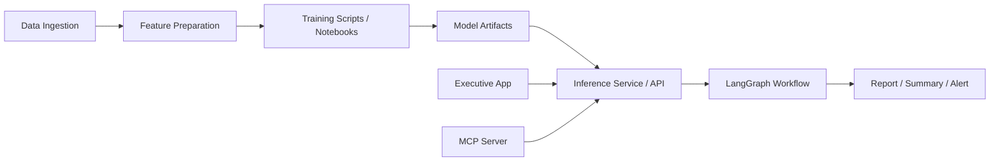

# Shankh — Lean System Design

## 1. Design goals
The system should stay lean and maintainable. The design should favor clarity over abstraction.

### Principles
- Keep ML training separate from workflow execution.
- Keep the orchestration graph simple: a few nodes, simple state, no heavy graph typing.
- Keep models out of the workflow graph itself. The graph should call a model service or an MCP tool.
- Keep EDA and training as separate notebooks and scripts.
- Keep the executive-facing application separate from the research engine.
- Start with LangChain and simple LangGraph graphs. Add deeper agent behavior later only if needed.

## 2. High-level architecture



## 3. Component layout

### 3.1 Data layer
Responsibilities:
- Pull market and filing data.
- Store raw and processed datasets.
- Keep data preparation simple and reproducible.

Suggested modules:
- data_ingestion/
- features/
- storage/

### 3.2 Training layer
Responsibilities:
- Run EDA.
- Train baseline and improved models.
- Save trained artifacts.

Suggested modules:
- notebooks/eda/
- notebooks/training/
- src/shankh/models/

The training layer should not be coupled to the runtime workflow. It should publish model artifacts that the runtime can load.

### 3.3 Inference / serving layer
Responsibilities:
- Load trained models.
- Expose predictions and explanations.
- Provide a small API for the workflow and app.

Recommended interface:
- FastAPI endpoints for forecast, regime, and microcap actions.
- Optional MCP server exposing the same capabilities as tools.

This layer is the boundary between ML and orchestration.

### 3.4 Workflow layer
Responsibilities:
- Coordinate a small number of steps.
- Call the inference service or MCP tools.
- Produce final research output.

Use a very simple LangGraph graph with around 4 to 6 nodes:
- collect
- analyze
- synthesize
- deliver

The graph state should be a plain dictionary such as:

```python
{
    "task": "forecast",
    "inputs": {...},
    "context": {...},
    "outputs": {},
    "notes": []
}
```

Avoid complex state schemas and nested graph objects.

### 3.5 Executive application layer
Responsibilities:
- Present summaries and reports.
- Provide a read-only experience for human review.
- Keep this separate from the core engine.

This can be a lightweight Streamlit or simple web app. It should not own training logic or model orchestration.

## 4. Workstream design

### 4.1 Price-band forecasting
- EDA and feature engineering live in notebooks and scripts.
- Training uses scikit-learn and XGBoost.
- Runtime uses a prediction service.
- The workflow only requests a forecast and receives a result.

### 4.2 Market regime analysis
- Use simple rules plus lightweight models.
- The workflow gathers context, asks the inference service for regime signals, and generates a narrative.

### 4.3 Microcap forensic review
- Use deterministic checks first.
- Add model-based scoring if useful.
- The workflow can call a scoring service and then generate a structured report.

### 4.4 Scenario exploration
- Keep this as a lightweight experiment module.
- Do not make it a core workflow dependency.

## 5. Deployment model
A simple deployment path is:
- local notebooks and scripts for training
- FastAPI service for inference
- LangGraph workflow for orchestration
- separate executive app for presentation

For a more tool-driven setup, expose the same capabilities through an MCP server.

## 6. Suggested folder structure

```text
src/shankh/
  common/
    data_ingestion/
    storage/
  models/
  workflows/
  services/
  agents/
  app/
notebooks/
  eda/
  training/
apps/
  executive/
prompts/
```

## 7. Recommended implementation sequence
1. Build data ingestion and storage.
2. Create a simple training pipeline for one workstream.
3. Expose predictions through a small API.
4. Add a minimal LangGraph workflow that calls the API.
5. Add the executive app as a separate surface.
6. Add MCP support only after the core service is stable.
